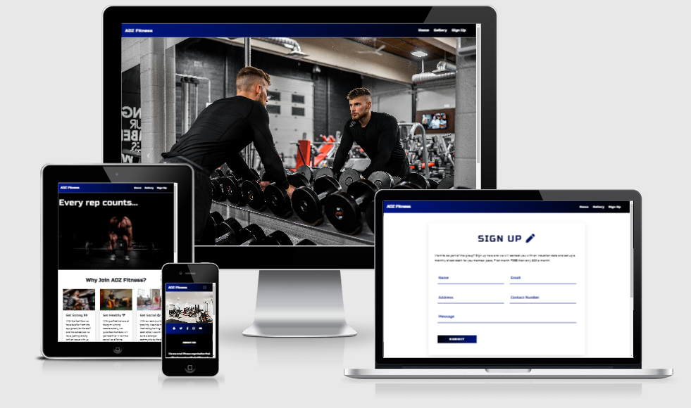
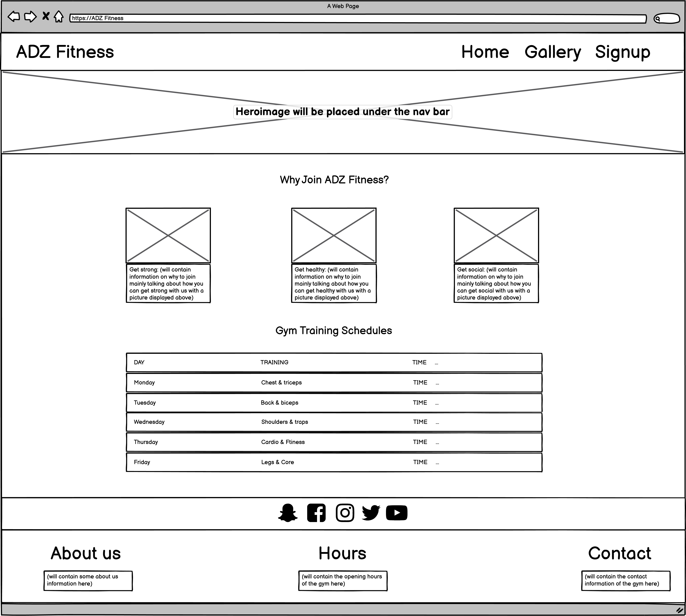
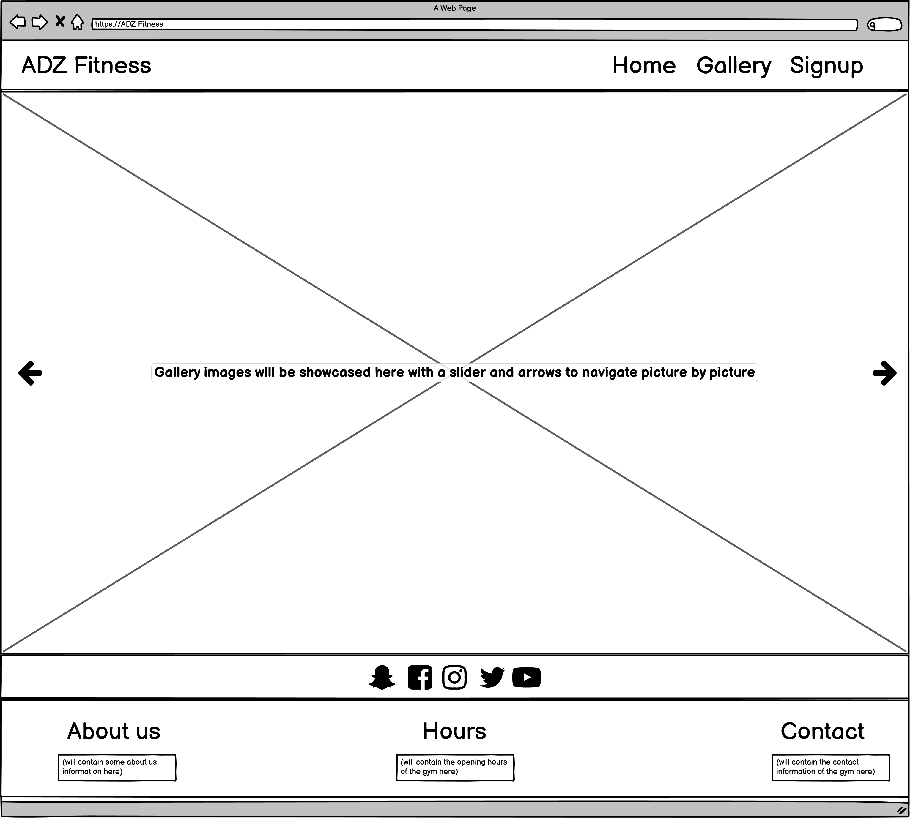
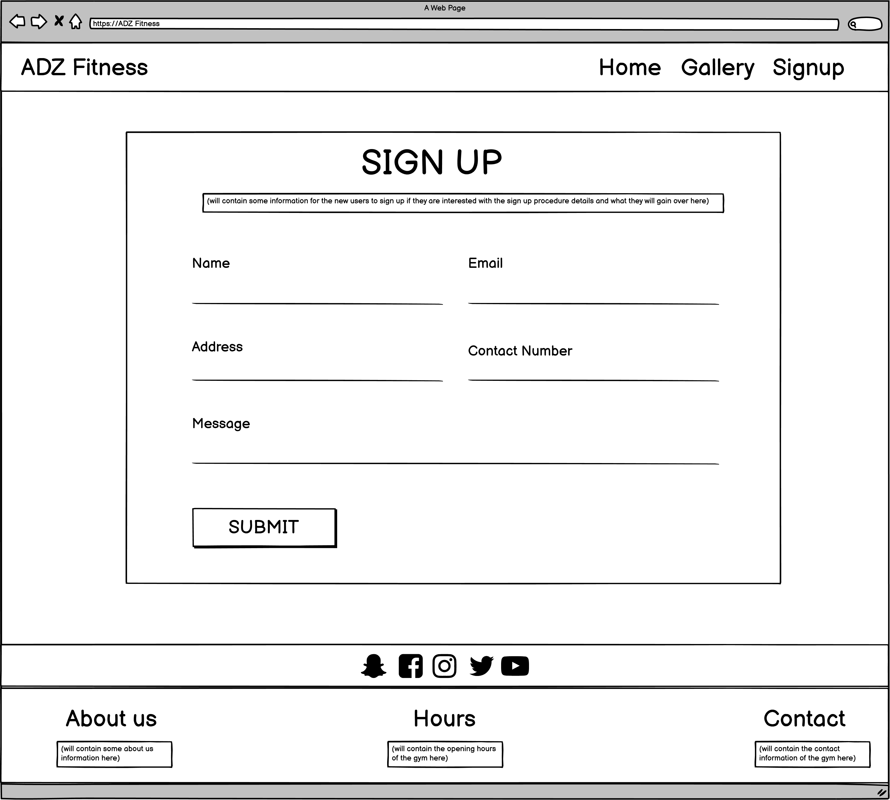
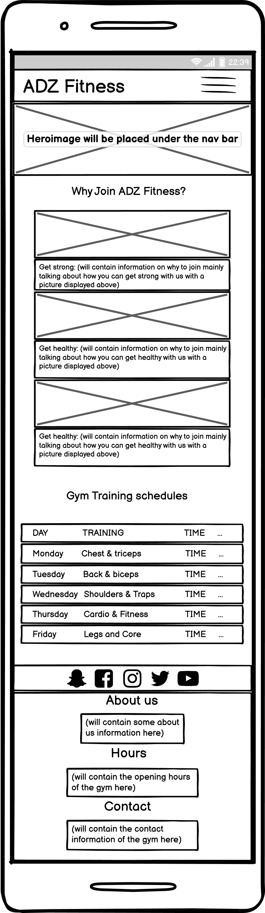
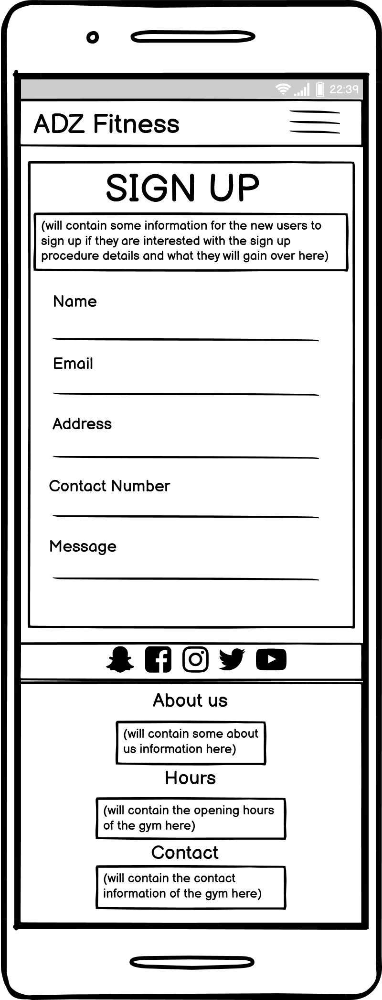
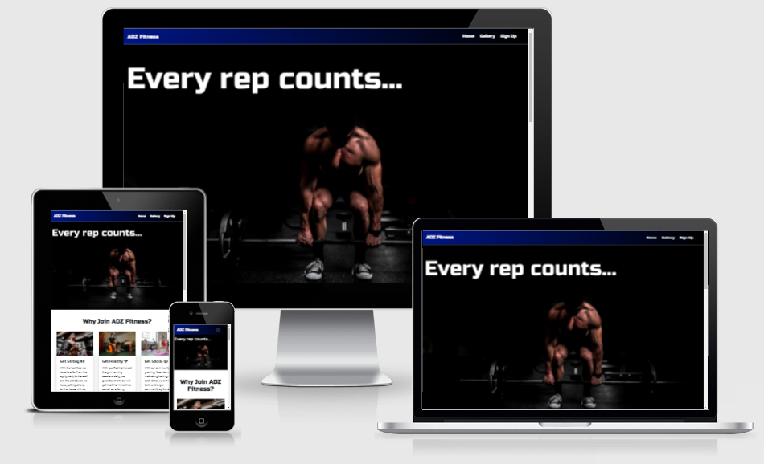
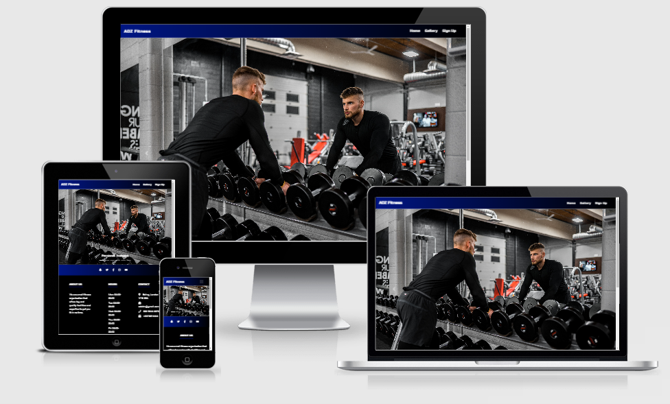
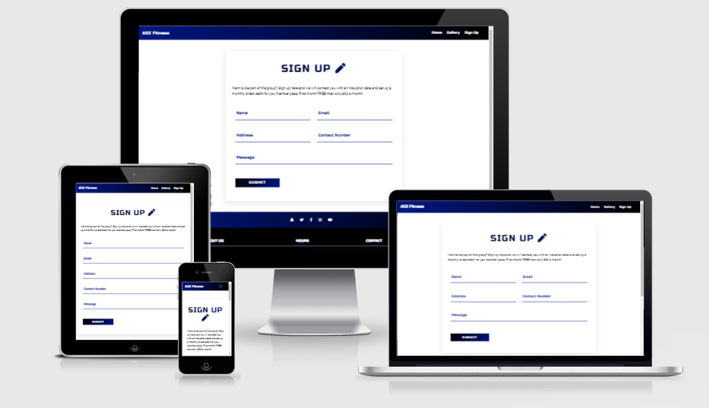

# Milestone project 1: Building a websitie for a gym ADZ Fitness



[Link to Live Website](https://adilkhr.github.io/my-ms1-project/)

[GitHub Repo](https://github.com/adilkhr/my-ms1-project)

***

## The purpose of the project

* To create a unique responsive website using HTML and CSS for a gym which will aim to attract potential members who are looking to get fit and healthy and want to sign up to a gym. They will also want to know more about the gym and what the gym has to offer including facilities, training sessions. The user will then have the option to sign up with the gym. The website will also aim to be useable for visting users and members who are already signed up to the gym.

***

## User Experience (UX)

## Strategy
### User Stories

#### First time visitor goals:

As a new user:

* I am looking to sign up to a gym as I feel that I need to keep myself fit and healthy
* I want to easily navigate the site and switch to other pages with ease aswell as being able to use the site on other devices
* I Want to know what the gym has to offer such as their aims for their members
* I want to know what training session the gym runs during the week
* I also want to know the location of the gym and the opening hours as I need to see if I can find a time that works for me
* I would also like to see what facilities the gym has to offer 
* I would like to also have an option to sign up for the gym and become a member
* I would like to have easy acess to the gym's contact information aswell as seeing their opening hours

#### Visting User goals:

* As a user, I want to find the information on the training sessions that the gym have on a weekly basis to see if there are any changes to the schedules
* As a user and a gym member, I want to have easy access to the contact information of the gym if I have any issues or queries, also be able to check the opening hours of the gym 
* As a user, I want to be able to use the site on any of my devices
* As a user, I would like to expand my connection with the gym by being able to access their social media pages 

#### Reasons for the website:

* To bring in more members
* To showcase work
* To allow new and exisiting members to contact us and connect with us

## Scope
#### What a user may expect:

* Easy to navigate website
* A site that is visually appealing on all devices
* Information about the gym and what they aim to do for members 
* links and function working as expected
* Ways to access and contact information with the gym and display their opening times

#### What a user may want:

* To be able to find links to the gym's social media pages and connect with them
* To see reviews from exisiting members of the gym and how they rate the gym's facilites and staff
* To be able to chat with someone online if any queries may occur
* To be able to sign up to the gym and become a member same day
* To be be able to see what activitys and sessions the gym offers during the week

#### As a developer / business I expect:

* To provide information about the gym
* To provide an easy way for new and existing members to contact us
* To showcase images of the gym's facilites and staff, and members
* To provide an easy to navigate website with links that work as expected
* To encourage new users to sign up and become a member of the gym

## Structure

The website will consist of 3 separate pages:

* A home page with a hero image and with a slogan "Every rep counts...", a section with the heading “Why join ADZ fitness” explaining reasons to join the gym with the gym's aims and goals for members, The gym's training schedules section which will showcase the gym's training sessions during the week 
* A gallery page that will showcase images of the gym's facilities and members
* A sign-up page with a form for new users to fill out that want to join the gym

***

## Features

### Navigation Bar:

The navigation bar will be vibrant and easy to use with the name of ADZ fitness with a home, sign-up and gallery button which users will be able to click to navigate from page to page. On smaller devices I have used a dropdown button to display the menu to make it fully responsive.

### Footer:

The footer will contain social media links for users to browse and connect with the gym. The footer will have an about us section, displays opening hours and contact information for the gym. The footer matches the vibrant design of the navigation bar.

### Home:

Home page includes details about the gym's goals and aims for members and new users. It showcases a bold hero image. It will display the gyms training schedules for the week. I have also included 3 image cards that feature - Get Strong, Get Healthy, Get Social. On smaller devices they are stacked and on larger devices they are spread horizontally.

### Sign up page:

Sign up page includes a sign-up form for new members to fill in their details so that they will be contacted with an induction date.

### Gallery Page:

The Gallery page displays the follwing images:

* The gym and its facilites
* Photos of gym members working out

I have used a bootstrap carousel to display the images.

***

## Future Features 

A future feature that I would like to add to my website would be a login portal. This would enable the members to track their stats, see their progress and make a timetable that suits them.

***

## Skeleton

### Wireframes:
Note: Wireframes for the desktop share the same strucuture for tablet

* Wireframes for desktop have been created for all three pages and can be viewed below and the pdf file through this link: (https://github.com/adilkhr/my-ms1-project/blob/master/wireframes/wireframesMS1desktop.pdf)





* Wireframes for mobile phone have been created for all three pages and can be viewed below and the pdf file through this link: (https://github.com/adilkhr/my-ms1-project/blob/master/wireframes/wireframesMS1phone.pdf)





### Mockup:





***

## Typography and color scheme

* For Typography I used google fonts and used the font familys of Russo one and Roboto with the Russo one font being the main font family used across the site as it stands out.
* The colour scheme used throughout the page were mainly white, black and a royal dark blue. I kept the colour theme to a minimum as i felt there was no need to overcomplicate the site as it may distract users from the content and would not look visually appealing. I used the hex values of #fff for an off-white colour and ##001684 for a nice dark royal blue shade across the page.

***

## Technonologies Used

* The Languages used to code my project were HTML5 to create the Mark-up language using sematic structure, and CCS3 for the Cascading style sheet used to style the content look visually appealing
* I used Google fonts and fontawesome icon links in my pages to add specific font styles aswell as icons to my page to make it look appealing and not dull and boring
* I used bootstrap version 4.6 to create sections of the pages so that it would be resonsive for all screens  
* I used Github to host the repository and Gitpod.io to write the code, and using the command line for committing and pushing the code to Github
* I used GIT for version control of the project
* I used Balsamiq wireframes to create wireframes for my site
* I used Paint to design the hero image of the home page

***

## Testing

### Supported screens:

After using bootstrap to build my pages and the use of CSS media queries styles, using the google inspect tool i was able to see that my site is supported for all screens with a width of 280px. I also did some testing by sending my website link to my friends and familys devices and they had seen no issues.

### Supported browsers: 

The website link has been tested on Google chrome, Internet Explorer and Microsoft edge, Brave and Firefox.

### OS compatibility:

Tested on iOS, Android 10, and Windows 10. - I asked a friend with an Adroid to test that it was working.
Tested for responsiveness using Chrome DevTools.

### Peformance Testing

Tested on the Developer Tools Lighthouse. This was the first time running through Lighthouse.


### Testing User Stories:

* #### A first user looking to sign up to the gym
The user can fill in the sign up form that has been created on the sign up page.
* #### A user looking to navigate the site and switch to other pages aswell as being able to use the site on other devices
The user can naviagate from page to page (Home, Gallery and Signup) with the responsive navbar and can navigate the page without any issue as the site for all pages and sections are responsive.
* #### A user wanting to know what training session the gym runs during the week
The user can see the gym's training sessions that are run during the week on the home page as it is layed out in a table.
* #### A user want to know the location of the gym and the opening hours
The user can see the gym's opening hours for all the days in the week on the footer for all pages.
* #### A user wanting to see images of the gym's facilities and other images related to the gym
The user can view images of the gym's facilites and member images working out on the gallery page.
* #### A user being able to acess the gym's contact information if they have any queries
The user can access the gym's contact information (address, email, phone, Fax) on the footer for all pages.
* #### A user wanting to connect to the gym's social media accounts
The user can click on the social media icons which are linked to their respective social media pages through the footer section.

### Code validation:

I had used the w3schools validator tool to see if there was any issues with my HTML and CSS codes, (https://validator.w3.org/).

* When inputing my index.html code through w3schools validator I had noticed there was erros with the images used for the gym's aims section as they did not have alt attributes, after adding the alt attributes there is no erros with the index html code.
* When inputing gallery.html code through w3schools validator there was no errors.
* When inputing signup.html code through w3schools validator I had a 2 major problems, I had a typo error with the for attributes for the label tags and I had also had the name attributes empty for the input tags in the sign up form, after resolving that issue, there is no erros with the signup html code. 
* When inputing CSS coding through w3schools validator there was no erros.

### Fixed bugs:

* An issue I was having with my home page was that I found that the gym trainning schedule table was not responsive for the galaxy fold screen which has a 280px screen width causing some horizontal scrolling to occur, I had fixed this issue by adding a media query to reduce the font size when viewed on smaller screen sizes.

***

## Deployment

### Github pages:

The deployment process of my project was done using the following steps:

1. Log in to GitHub and locate the GitHub Repository of the project currently working on.

2. At the top of the Repository (not top of page), locate the "Settings" Button on the menu.

3. Scroll down the Settings page until you locate the "GitHub Pages" Section.

4. Under "Source", click the dropdown called "None" and select "Master Branch".

5. The page will automatically refresh.

6. Scroll back down through the page to locate the now published site link in the "GitHub Pages" section.

### Forking the GitHub Repository:

By forking the GitHub Repository you will be able to make a copy of the original repository on your own GitHub account allowing you to view and/or make changes without affecting the original repository by using the following steps:

1. Log in to GitHub and locate the [GitHub Repository](https://github.com/)
2. At the top of the Repository (not top of page) just above the "Settings" Button on the menu, locate the "Fork" Button.
3. You should now have a copy of the original repository in your GitHub account.

### Making a Local Clone

1. Log in to GitHub and locate the [GitHub Repository](https://github.com/)
2. Under the repository name, click "Clone or download".
3. To clone the repository using HTTPS, under "Clone with HTTPS", copy the link.
4. Open Git Bash
5. Change the current working directory to the location where you want the cloned directory to be made.
6. Type `git clone`, and then paste the URL you copied in Step 3.

```
$ git clone https://github.com/YOUR-USERNAME/YOUR-REPOSITORY
```

7. Press Enter. Your local clone will be created.

```
$ git clone https://github.com/YOUR-USERNAME/YOUR-REPOSITORY
> Cloning into `CI-Clone`...
> remote: Counting objects: 10, done.
> remote: Compressing objects: 100% (8/8), done.
> remove: Total 10 (delta 1), reused 10 (delta 1)
> Unpacking objects: 100% (10/10), done.
```

***

## Credits

### Code:

* I have used [bootstrap library](https://getbootstrap.com/docs/4.6/getting-started/introduction/) version 4.6 to help me create a responsive site by using bootsrap navigation to build the nav bar, bootstrap cards to create the gym's goals and aims section in the home page, bootstrap table to create a responsive gym training schedule in the home page aswell as using bootsrap carousel to showcase the gym's photos in the gallery page aswell as using bootstrap forms to create a responsive signup form and bootstrap footer for the responsive footer.

### media:

* All images used were taken from [Unsplash](https://unsplash.com/).

### Acknowledgements

* Rohit Sharma (mentor support) - provided me with help on how to strucutre the site and make it responsive using bootstrap.
* Matt Rudge - Template for gitpod.io.
* Igor_ci (from slack) Provided help on how to link wireframes to the README.
* Full Stack Developers WhatApp group (members of the codeinstitute slack community) - for taking the time to test the website aswell as providing help when needed with issues such as fixing table responsivness.
* Rebecca Kelsall (fellow codeinstiute student)  - for proof reading my README.md.

* I had used the Code [institute sample read me template](https://github.com/Code-Institute-Solutions/SampleREADME) to strcuture my own readme.
* I had used [Tiny PNG](https://tinypng.com/) to change some images to smaller sizes.
* [Am I Responsive](http://ami.responsivedesign.is/#) was used in checking the responsive nature for my site alongside creating the mockup files.
* [W3schools](https://www.w3schools.com/) was used for various code information and trouble shooting problems.
* [Google fonts](https://fonts.google.com/) - CDN for the fonts were used in the project.
* [Balsamiq wireframe](https://balsamiq.com/) was used To build wireframes.
* [HTML & CSS Validator](https://validator.w3.org/) was used for testing the validity of HTML and CSS code.
* [HTMl Color Codes](https://htmlcolorcodes.com/) - used to pick specific colours for my site.

### Content:

Code & Content (not already attributed): Adil Khair

### inspirtation:

* I had taken some inspirtation from the code institute project [Love running](https://github.com/Code-Institute-Solutions/Love-Running-Solutions) to help give me an idea on how to strucutre my site and what to include in my pages.


